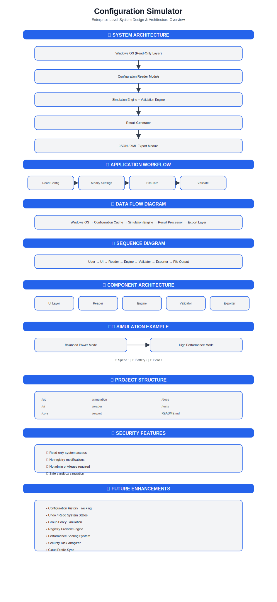

# Configuration-Simulator
A safe, read-only Windows configuration simulator that allows users to explore, modify, and preview system settings without making any real changes to their operating system.

  

